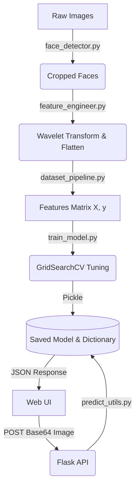

# Sports Celebrity Image Classification System

An enterprise-grade, end-to-end Machine Learning pipeline and Web Application designed to classify famous sports celebrities from images using Computer Vision and Support Vector Machines.

## 🏗️ Architecture Diagram


## 🚀 Installation Guide

1. **Clone the repository** (if applicable) and navigate to the root directory.
2. **Create a virtual environment**:
   ```bash
   python -m venv venv
   source venv/bin/activate  # On Windows: venv\Scripts\activate
   ```
3. **Install dependencies**:
   ```bash
   pip install -r requirements.txt
   ```

## 📊 Dataset Preparation & Training Guide

1. Place your raw images inside `dataset/` (organized in folders by athlete name, e.g., `dataset/roger_federer/`).
2. Run the training pipeline (you can create a script `run_training.py` that imports `dataset_pipeline.prepare_dataset` and `train_model.train_and_evaluate`).
3. Artifacts, metrics, and models will be automatically saved to `artifacts/`, `evaluation/`, and `models/` respectively.

## 🔌 API Documentation

### `POST /predict`
Predicts the athlete in the given image.

**Request Body:**
```json
{
  "image_data": "data:image/jpeg;base64,/9j/4AAQSkZJRg..."
}
```

**Response:**
```json
{
  "athlete": "Roger Federer",
  "confidence": 96.41,
  "probabilities": {
    "Roger Federer": 96.41,
    "Serena Williams": 3.59
  }
}
```

## 🌐 Deployment Guide

### Local Machine
```bash
python api/app.py
# Access http://localhost:5000 in your browser
```

### Docker
1. Create a `Dockerfile`:
   ```dockerfile
   FROM python:3.12-slim
   WORKDIR /app
   COPY . /app
   RUN apt-get update && apt-get install -y libgl1-mesa-glx
   RUN pip install -r requirements.txt
   CMD ["python", "api/app.py"]
   ```
2. Build and run:
   ```bash
   docker build -t sports-classifier .
   docker run -p 5000:5000 sports-classifier
   ```

### Render / Railway
1. Push the code to a GitHub repository.
2. Link the repository to your Render/Railway dashboard.
3. Define the build command: `pip install -r requirements.txt` (ensure OpenCV dependencies like `libgl1` are handled via environment or buildpacks).
4. Define the start command: `gunicorn -w 4 -b 0.0.0.0:$PORT api.app:app`

## 🛠 Troubleshooting
- **No Face Detected**: Ensure the image has a clear, unobstructed frontal view of the face with two visible eyes. The Haar Cascade is sensitive to lighting and angles.
- **OpenCV Errors**: Ensure `libgl1-mesa-glx` is installed on your Linux production server.

## 🔮 Future Improvements
- Transition from traditional Haar Cascades to MTCNN or RetinaFace for more robust face detection.
- Replace Scikit-Learn models with a Convolutional Neural Network (CNN) like ResNet50 or MobileNet for higher accuracy.
- Implement a feedback loop where users can correct wrong predictions to continuously train the model.
